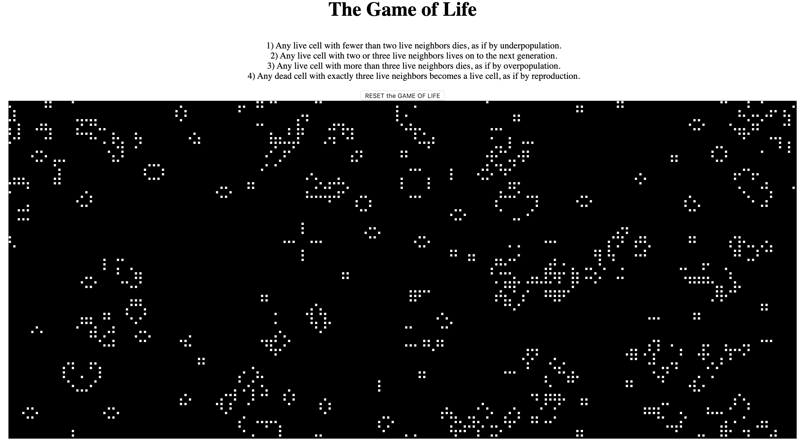

# ✅ Conways-game-of-life

# Click to play: https://amazing-hoover-408f5b.netlify.com/

## Used javascript in order to depict Conways game of LIFE
## The rules are simple

## 1) Any live cell with fewer than two live neighbors dies, as if by underpopulation.
## 2) Any live cell with two or three live neighbors lives on to the next generation.
## 3) Any live cell with more than three live neighbors dies, as if by overpopulation.
## 4) Any dead cell with exactly three live neighbors becomes a live cell, as if by reproduction.
